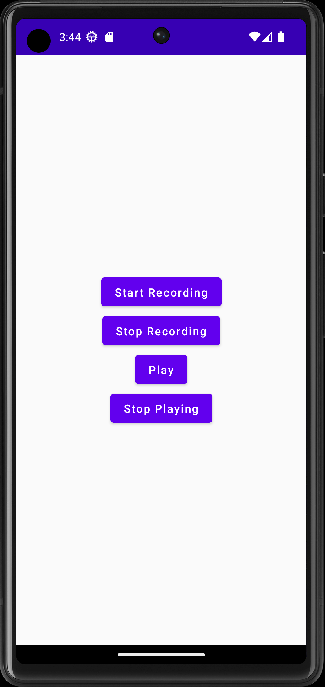

# RecordAndPlayAudioApp
This is a simple Record &amp; Play Audio App that works with Uri, Android MediaRecorder & MediaPlayer. You can record your voice and play it back. It uses your device microphone and asks you for permission before hand. 

If you would like to make better quality audio recording, please change "OutputFormat" and "AudioEcoder" values in "AndroidAudioRecorder" class which is located inside the "record" package

# Demonstration

